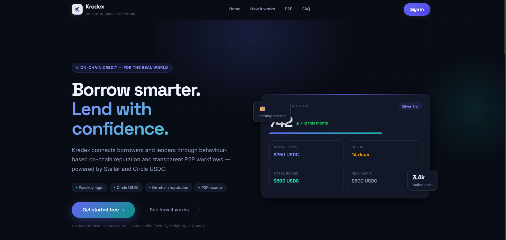
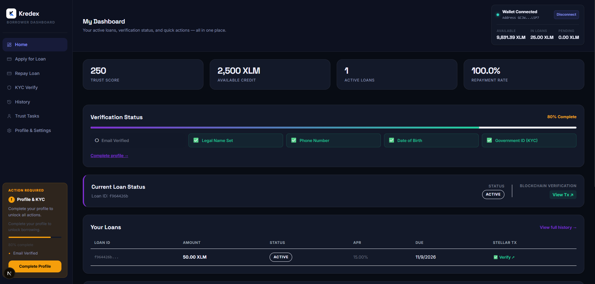
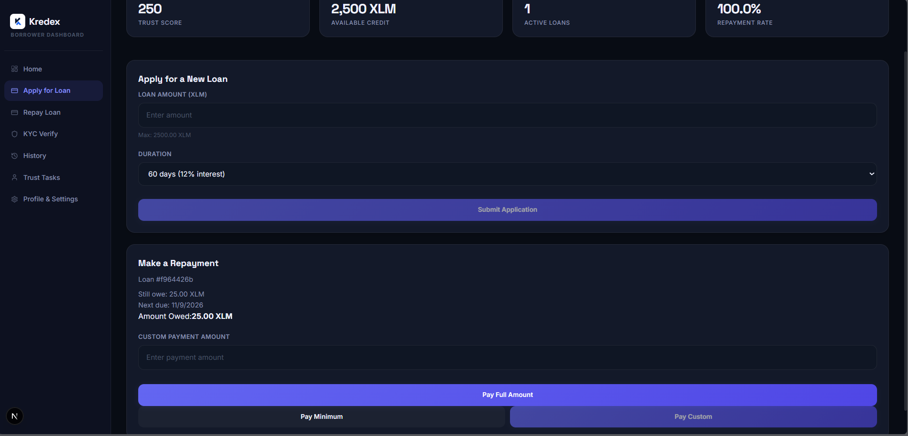
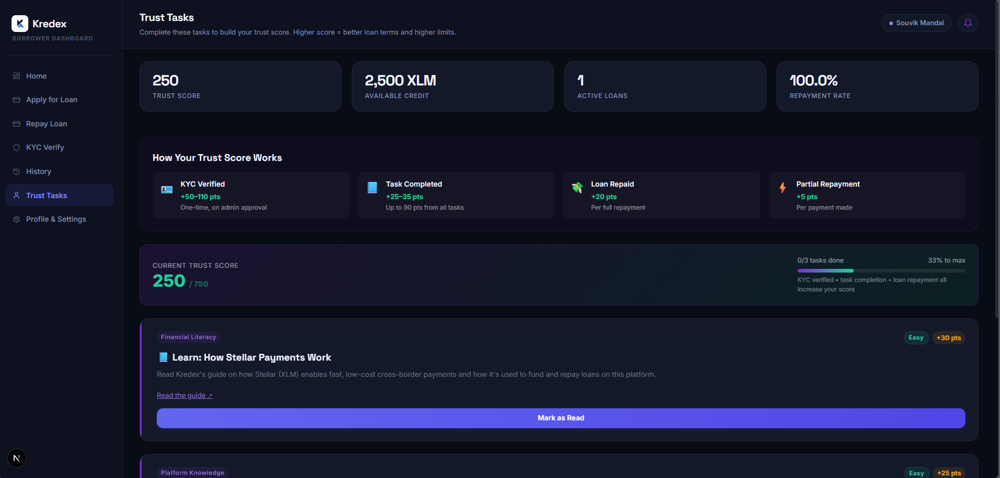
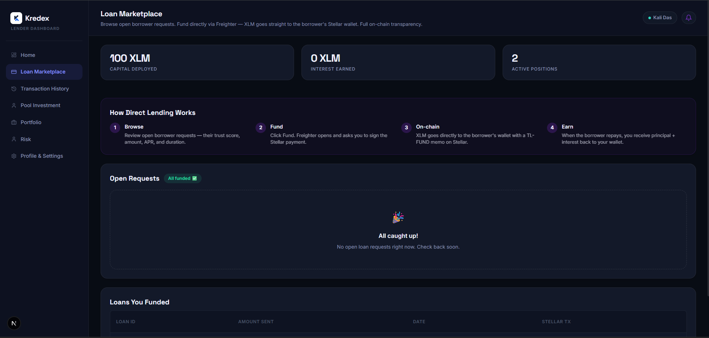
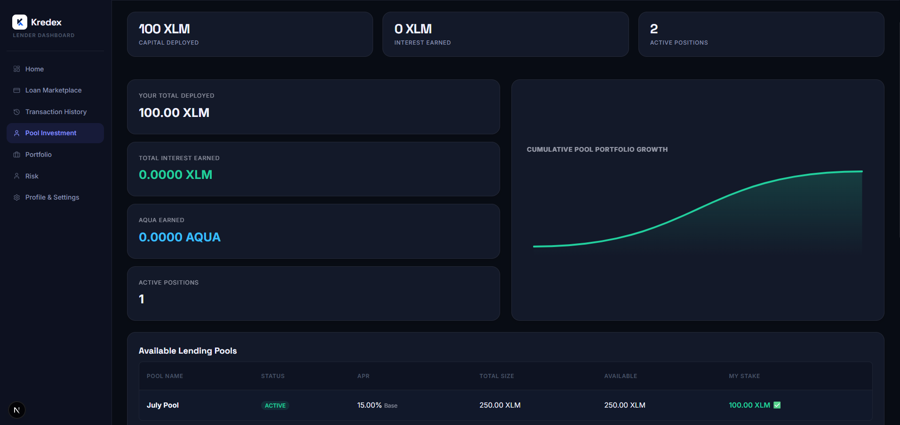
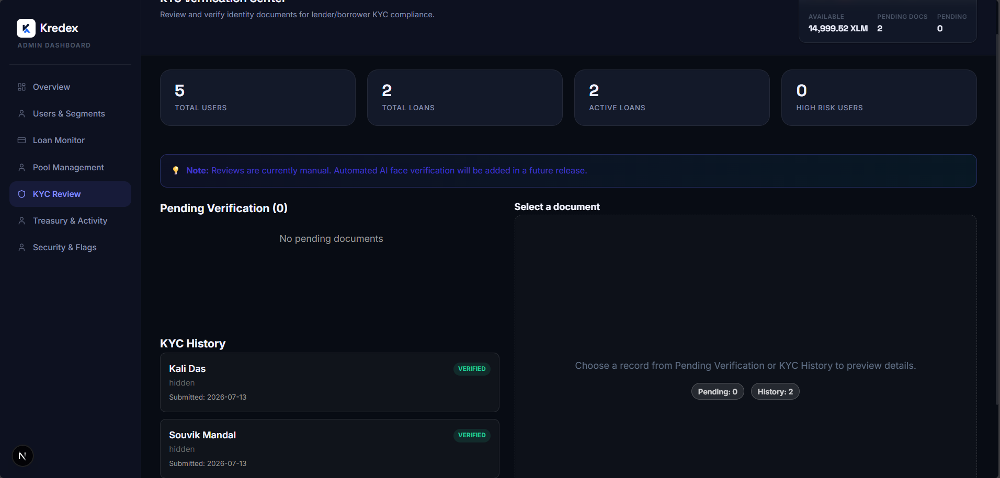
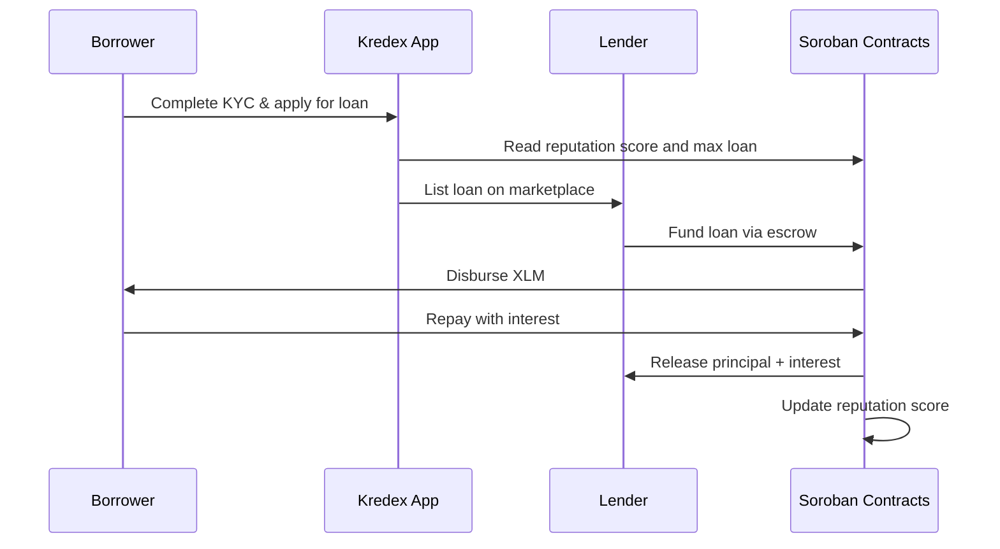

<p align="center">
  
</p>

<h1 align="center">Kredex</h1>

<p align="center"><em>Secure and easy P2P lending and borrowing - built on trust, powered by Stellar &amp; Soroban.</em></p>

<p align="center">
  <a href="https://github.com/kredex-org/product/actions/workflows/frontend.yml"></a>
  <a href="https://github.com/kredex-org/product/actions/workflows/security.yml"></a>
  
  
  
  
  
  
</p>

<p align="center">
  <a href="https://kredex.vercel.app"><strong>Live App</strong></a> ·
  <a href="https://kredex-docs.vercel.app">Docs</a> ·
  <a href="https://youtu.be/5tPY8XqotMM">Demo Video</a> ·
  <a href="https://github.com/kredex-org/contracts">Contracts</a> ·
  <a href="https://github.com/orgs/kredex-org/discussions">Discussions</a> ·
  <a href="https://x.com/kredexweb3">X</a>
</p>

---

## Table of contents

- [About](#about)
- [Features](#features)
- [Screenshots](#screenshots)
- [Quick start](#quick-start)
- [Tech stack](#tech-stack)
- [Project structure](#project-structure)
- [How it works](#how-it-works)
- [Smart contracts](#smart-contracts)
- [Testing](#testing)
- [Contributing](#contributing)
- [Community](#community)
- [Roadmap](#roadmap)
- [License](#license)

## About

Traditional credit excludes billions of underbanked people because it demands collateral and a centralized credit score. **Kredex** uses **on-chain reputation** instead. Borrowers start small, repay on time, and unlock larger loans at lower interest. Lenders are protected by escrow contracts, dynamic risk models and automated default handling.

> **Real-world example:** a small business owner needs \$500 for inventory but has no collateral. They complete KYC, borrow \$50 first, and repay on time. Their on-chain reputation rises, which unlocks the \$500 loan at a lower rate. A lender on the other side of the world funds it directly and earns yield with full transparency.

> ⚠️ **Status:** Kredex is live on **Stellar Testnet** and **has not been audited**. Do not use real funds.

This repository is the **web application**. The smart contracts live in [kredex-org/contracts](https://github.com/kredex-org/contracts) and the documentation in [kredex-org/docs](https://github.com/kredex-org/docs).

## Features

| Feature | Description |
| :-- | :-- |
| **On-chain reputation** | Borrowers earn score for on-time repayments, tracked on Soroban |
| **Soulbound NFT badges** | High-reputation users receive non-transferable badges |
| **P2P loan marketplace** | Lenders browse and fund individual loan requests through escrow |
| **Automated liquidity pools** | Passive, diversified lending with utilization-based rates |
| **Batch disbursement** | Admins can fund many approved loans at once |
| **Passwordless auth** | Freighter wallet signatures or biometric passkeys |
| **SEP-12 style KYC** | Identity verification flow with admin review |
| **Role dashboards** | Borrower, lender and admin experiences, with analytics |

## Screenshots

<p align="center">
  
</p>

<details>
<summary><strong>More screenshots</strong></summary>

| | |
| :-: | :-: |
|  |  |
|  |  |
|  |  |

</details>

## Quick start

> New to open source? You can have this running in about 10 minutes. See the full walk-through in **[docs/DEVELOPMENT.md](docs/DEVELOPMENT.md)**.

### Prerequisites

| Tool | Version | Notes |
| :-- | :-- | :-- |
| [Node.js](https://nodejs.org) | 20+ | Includes npm |
| [Freighter](https://www.freighter.app) | latest | Browser wallet, set to **Testnet** |
| [Neon](https://neon.tech) | free tier | Serverless Postgres |
| [Upstash](https://upstash.com) | free tier | Redis cache |

You do **not** need Rust or the Stellar CLI unless you work on contracts. The app talks to the contracts already deployed on Testnet.

### Run locally

```bash
# 1. Clone
git clone https://github.com/kredex-org/product.git
cd product

# 2. Install
npm install

# 3. Configure environment
cp .env.example .env.local
# Edit .env.local: DATABASE_URL, DIRECT_URL, UPSTASH_*, JWT_SECRET, contract IDs...

# 4. Set up the database
npx prisma generate
npx prisma db push

# 5. Start
npm run dev
```

Open <http://localhost:3000>.

| Command | Purpose |
| :-- | :-- |
| `npm run dev` | Dev server |
| `npm run build` | Production build |
| `npm run lint` | ESLint |
| `npx tsc --noEmit` | Type-check |
| `npx prisma studio` | Browse the database |

**Testnet contract IDs** for your `.env.local` are in the [contracts reference](https://github.com/kredex-org/contracts/blob/main/docs/CONTRACTS.md) and the table [below](#smart-contracts).

**Get a funded Testnet wallet:** install Freighter → switch to Testnet → fund it with [Friendbot](https://friendbot.stellar.org) (free).

## Tech stack

| Layer | Technology |
| :-- | :-- |
| Frontend | Next.js 16 (App Router, Server Actions), React 19, TypeScript, Tailwind CSS 4 |
| Data | Neon (serverless Postgres) + Prisma ORM |
| Cache | Upstash Redis |
| Blockchain | `@stellar/stellar-sdk`, Freighter, Smart Account Kit (passkeys) |
| Contracts | Soroban (Rust), see [contracts repo](https://github.com/kredex-org/contracts) |
| Hosting | Vercel |

## Project structure

```text
product/
├─ app/                    # Next.js App Router
│  ├─ api/                 # API routes (KYC, loans, notifications, cron)
│  ├─ actions/             # Server actions
│  ├─ auth/                # Sign-in / sign-up
│  ├─ dashboard/           # Role-based dashboards (admin, borrower, lender)
│  └─ p2p/, faq/           # Marketplace and info pages
├─ components/
│  ├─ dashboard/           # Dashboard widgets (metrics, forms, tables)
│  ├─ landing/             # Landing page sections
│  └─ ui/                  # Shared UI primitives
├─ lib/
│  ├─ stellar/             # soroban.ts (build → simulate → sign → submit → poll), batch-disburse.ts
│  ├─ contracts/           # Typed clients for the Soroban contracts (+ generated bindings)
│  ├─ auth/                # JWT session management
│  ├─ kyc/ ipfs/ redis/    # KYC, storage, caching
│  └─ prisma.ts            # Prisma client
├─ prisma/schema.prisma    # Database schema
├─ sql/                    # SQL setup scripts
├─ scripts/                # Maintenance and seed scripts
├─ docs/                   # Internal design & process docs
├─ public/ assets/         # Static assets and screenshots
└─ types/                  # Shared TypeScript types
```

## How it works



Every on-chain write follows the same 7-step flow in [`lib/stellar/soroban.ts`](lib/stellar/soroban.ts): **fetch** account → **build** → **simulate** → **assemble** → **sign** (Freighter) → **submit** → **poll** until success.

More detail: [docs/ARCHITECTURE.md](docs/ARCHITECTURE.md).

## Smart contracts

Deployed on **Stellar Testnet**. Source and function reference: [kredex-org/contracts](https://github.com/kredex-org/contracts).

| Contract | Testnet ID | Explorer |
| :-- | :-- | :-- |
| Reputation | `CDPALR5OWSO2HFSTB262IPUJNGRDVJOE5AGODXPVSSRPWVRAYK5Q6BOV` | [Verify](https://stellar.expert/explorer/testnet/contract/CDPALR5OWSO2HFSTB262IPUJNGRDVJOE5AGODXPVSSRPWVRAYK5Q6BOV) |
| Escrow | `CBNF4KK4JHQ5UUUC4W65WHA3WOB2FWCIRG3L2R3M5TEKKE6ZPSMUEAP5` | [Verify](https://stellar.expert/explorer/testnet/contract/CBNF4KK4JHQ5UUUC4W65WHA3WOB2FWCIRG3L2R3M5TEKKE6ZPSMUEAP5) |
| Lending | `CAJ5VLQZ2ZKOCVQKFX7LFYF36LNLCDT6QJT4STAZFQ5P23TZZ4UBEGXQ` | [Verify](https://stellar.expert/explorer/testnet/contract/CAJ5VLQZ2ZKOCVQKFX7LFYF36LNLCDT6QJT4STAZFQ5P23TZZ4UBEGXQ) |
| Default Mgmt | `CDXUYZL5IJNGN742IZTC7H4IBKNEGTSMZACO76LXTVJSDVXXF2NSBOED` | [Verify](https://stellar.expert/explorer/testnet/contract/CDXUYZL5IJNGN742IZTC7H4IBKNEGTSMZACO76LXTVJSDVXXF2NSBOED) |
| Liquidity Pool | `CBUNFNEDSL3R2QTHLJVG4LOTRPYWTY557WZJIBGAMCGP2YDAHNOUKBCA` | [Verify](https://stellar.expert/explorer/testnet/contract/CBUNFNEDSL3R2QTHLJVG4LOTRPYWTY557WZJIBGAMCGP2YDAHNOUKBCA) |
| Oracle Adapter | `CBDXC63B7PO2DPZWZ2UGRTRCHNO2YIS5QP6SKRWJIJAPZQG5B3X4F2A3` | [Verify](https://stellar.expert/explorer/testnet/contract/CBDXC63B7PO2DPZWZ2UGRTRCHNO2YIS5QP6SKRWJIJAPZQG5B3X4F2A3) |

## Testing

1. Set Freighter to **Testnet** and fund your wallet via [Friendbot](https://friendbot.stellar.org).
2. Sign up at `/auth`, complete KYC, then use the borrower and lender dashboards end to end.
3. Use `npx prisma studio` to inspect database state.
4. Before a PR, run `npx tsc --noEmit`, `npm run lint` and `npm run build`.

Detailed guides: [docs/TESTING_GUIDE.md](docs/TESTING_GUIDE.md) · [docs/TESTING_MVP.md](docs/TESTING_MVP.md).

## Contributing

Contributors of **every** level are welcome, from first-timers to experienced engineers.

| Level | Ideas |
| :-- | :-- |
| 🌱 Beginner | Fix UI copy and typos, improve accessibility, add a copy button, polish empty states |
| 🔧 Intermediate | Add tests, improve loading and error states, build dashboard features |
| 🏗️ Advanced | Harden auth and KYC, optimize RPC usage and caching, mainnet-readiness work |

1. Read **[CONTRIBUTING.md](CONTRIBUTING.md)**.
2. Pick a [`good first issue`](https://github.com/kredex-org/product/labels/good%20first%20issue).
3. Say hi in [Discussions](https://github.com/orgs/kredex-org/discussions) if you get stuck. We're friendly.

User-requested improvements are tracked in [docs/USER_FEEDBACK.md](docs/USER_FEEDBACK.md). Many are great starting points.

## Community

- 💬 [GitHub Discussions](https://github.com/orgs/kredex-org/discussions)
- 🐦 [@kredexweb3 on X](https://x.com/kredexweb3)
- 📝 [Feedback form](https://forms.gle/mKWhbRfxiwmz4Xq39)
- 🔐 [Security policy](https://github.com/kredex-org/.github/blob/main/SECURITY.md): report vulnerabilities **privately**
- 📜 [Code of Conduct](https://github.com/kredex-org/.github/blob/main/CODE_OF_CONDUCT.md)

## Roadmap

Planned for mainnet: fiat on/off ramps, USDC support, institutional liquidity pools, and an independent security audit. See the [full roadmap](https://github.com/kredex-org/.github/blob/main/ROADMAP.md).

## License

[MIT](LICENSE) © Kredex Org
